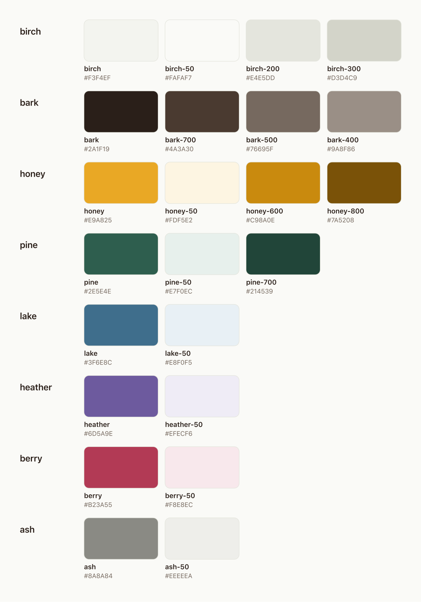

# JobBear brand kit

Everything you need to make something that looks like JobBear: the bear, the wordmark, the
colors and the type. The app's source of truth is
[`frontend/tailwind.config.ts`](../../frontend/tailwind.config.ts) and
[`BearMark.tsx`](../../frontend/src/components/BearMark.tsx); this folder mirrors them.

<p>
  
  &nbsp;&nbsp;
  
</p>

## The bear

A geometric bear head: bark (dark brown) with honey ears and muzzle. It is friendly, calm and
a little sleepy. It reads your recruiter email so you don't have to.

| File | Use it for |
|---|---|
| [`logo/bear.svg`](logo/bear.svg) | The default mark, on light backgrounds |
| [`logo/bear-badge.svg`](logo/bear-badge.svg) | On dark backgrounds: the bear on a birch disc, as in the app's sidebar |
| [`logo/bear-asleep.svg`](logo/bear-asleep.svg) | Empty and quiet states ("nothing new") |
| [`logo/bear-mono.svg`](logo/bear-mono.svg) | One color that inherits `currentColor`, for inline icons |
| [`logo/bear-mono-bark.svg`](logo/bear-mono-bark.svg), [`bear-mono-birch.svg`](logo/bear-mono-birch.svg) | One-color print, stamps, photos, dark backgrounds |
| [`logo/icon.svg`](logo/icon.svg), [`icon-honey.svg`](logo/icon-honey.svg) | Square app icons and avatars (GitHub, social, PWA) |

**Lockups** (bear + wordmark): [`lockup.svg`](logo/lockup.svg) for light backgrounds,
[`lockup-on-dark.svg`](logo/lockup-on-dark.svg) for dark ones, plus one-color versions
([`lockup-mono-bark.svg`](logo/lockup-mono-bark.svg), [`lockup-mono-birch.svg`](logo/lockup-mono-birch.svg)).
**Wordmark only:** [`wordmark.svg`](logo/wordmark.svg), [`wordmark-birch.svg`](logo/wordmark-birch.svg).
The wordmark is outlined, so it renders the same without the font installed.

**PNGs** live in [`png/`](png): the bear at 16 to 1024 px, icons at 180 / 192 / 512 / 1024
(180 is the Apple touch icon), and lockups 128 and 256 px tall. [`favicon.ico`](favicon.ico)
holds 16, 32 and 48 px. [`social/social-preview.png`](social/social-preview.png) is the
1280×640 card for the GitHub repo and link previews.

### Do

- Give the bear room: clear space of at least a quarter of its width on every side.
- Keep it at 16 px or larger; below that, the eyes disappear.
- On dark or busy backgrounds, use the badge or a one-color version.

### Don't

- Recolor it, outline it, add shadows or gradients, or stretch it.
- Put the full-color bear straight on bark or on a photo; it disappears.
- Rebuild the wordmark in another font, or set "JobBear" in a different case (not "Jobbear", not "JOBBEAR").

## Colors



Light, warm paper (birch), dark ink (bark) and **one accent: honey**. The nature tones are
reserved for application statuses, so a badge's color always means something.

| Token | Hex | Role |
|---|---|---|
| `birch` | `#F3F4EF` | Page background. `birch-50` `#FAFAF7` raised surfaces, `birch-200` `#E4E5DD` hairlines, `birch-300` `#D3D4C9` borders |
| `bark` | `#2A1F19` | Text and dark surfaces. `bark-700` `#4A3A30`, `bark-500` `#76695F` secondary text, `bark-400` `#9A8F86` placeholders |
| `honey` | `#E9A825` | The accent: primary buttons, focus rings, the weekly goal line, *Interviewing*. `honey-50` `#FDF5E2`, `honey-600` `#C98A0E`, `honey-800` `#7A5208` |
| `lake` | `#3F6E8C` | *Applied* |
| `heather` | `#6D5A9E` | *OA* (online assessment) |
| `pine` | `#2E5E4E` | Good news: *Offer*, and `pine-700` `#214539` for *Accepted* |
| `berry` | `#B23A55` | No: *Rejected*, errors |
| `ash` | `#8A8A84` | Silence: *Ghosted*, muted |

Each status color also has a `-50` tint for badge backgrounds. Machine-readable versions:
[`colors/design-tokens.json`](colors/design-tokens.json) ([W3C design tokens](https://www.designtokens.org/) format)
and [`colors/tokens.css`](colors/tokens.css) (CSS custom properties).

### Contrast

Measured against WCAG 2.2 (AA needs 4.5 for body text, 3 for large text and UI shapes).

| Pair | Ratio | OK for |
|---|---|---|
| `bark` on `birch` | 14.5 | Everything |
| `bark-500` on `birch` | 4.8 | Body text |
| `bark` on `honey` | 7.7 | Text on honey buttons. **Always bark, never white, on honey** |
| `honey-800` on `honey-50` | 6.4 | Honey badges |
| `pine` / `lake` / `heather` / `berry` on their `-50` | 4.8–6.4 | Status badges |
| `ash` on `birch` | 3.1 | Icons and large text only |
| `bark-400` on `birch` | 2.9 | Placeholders and decoration only, never real content |
| `honey` on `birch` | 1.9 | Fills only. Never honey text on a light background |

## Type

| Role | Font | Weights |
|---|---|---|
| Display: headings, numbers, the wordmark | [Bricolage Grotesque](https://fonts.google.com/specimen/Bricolage+Grotesque) | 500–800; the wordmark is Bold with `-0.025em` tracking |
| Body and UI | [Onest](https://fonts.google.com/specimen/Onest) | 400–700 |

Both are free under the SIL Open Font License, and the app loads them from Google Fonts.

## Shape

Corners are soft but not bubbly: `1.125rem` for panels and cards, `0.625rem` for buttons
and inputs.

## Using the brand

The files here are part of the repository under [AGPL-3.0](../../LICENSE). Use them freely to
contribute to JobBear, write about it or link to it. If you ship your own fork as a separate
product, give it its own name and logo so people can tell it apart from the official project.

## Regenerating the PNGs

Edit the SVGs, then run:

```bash
docs/brand/export.sh   # needs: brew install librsvg imagemagick
```
