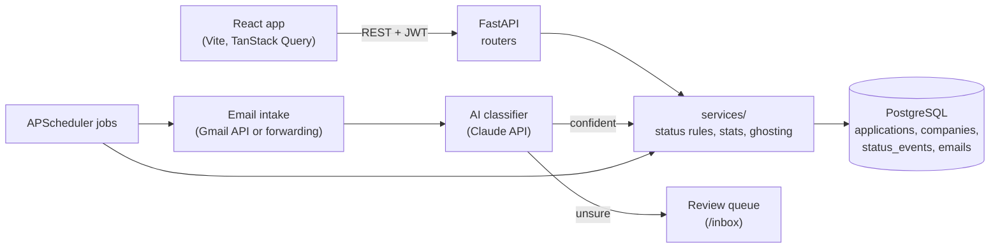

# Development

How the code is laid out, how to run it locally and how to test it. Before opening a pull
request, read [CONTRIBUTING.md](../CONTRIBUTING.md).

## Architecture



- **Routers stay thin.** Business rules live in `services/`.
- **One way to change a status.** Every change, manual or automatic, goes through one
  function that also writes a `status_events` row. The timeline and the analytics read from it.
- **The AI never acts alone when unsure.** Low-confidence results wait in the review queue.

## Project structure

```
backend/
  app/
    api/            FastAPI routers (thin)
    models/         SQLAlchemy 2.0 models
    schemas/        Pydantic v2 request/response models
    services/       Business rules: status changes, stats, ghosting
    integrations/   Gmail and Claude clients
    jobs/           APScheduler jobs (email sync, ghosting)
    scripts/        One-off commands (Notion CSV import)
  alembic/          Database migrations
  tests/            pytest
frontend/
  src/
    pages/          One file per route
    components/     UI building blocks
    api/, hooks/    Data access (TanStack Query)
    sample/         Demo data the UI runs on today
infra/postgres/     Database init script (creates the test database)
docs/               Guides and the brand kit
.github/            CI, issue and PR templates, code of conduct, security policy
.claude/skills/     Impeccable design skill used for all UI work (Apache-2.0)
```

## Run it locally

You need Docker, [uv](https://docs.astral.sh/uv/) and Node 20+.

```bash
cp .env.example .env
docker compose up --build
cd backend && uv run alembic upgrade head
```

Frontend: http://localhost:5173 · API docs: http://localhost:8000/docs

Frontend only (no backend; pages use the sample data in `frontend/src/sample/`):

```bash
cd frontend && npm ci && npm run dev
```

## Checks and tests

Run these before every pull request. CI runs the same ones.

```bash
# Backend
cd backend && uv run ruff check . && uv run ruff format --check . && uv run mypy app alembic tests && uv run pytest

# Frontend
cd frontend && npm run format:check && npm run lint && npm run typecheck && npm test && npm run build
```

The backend tests use a separate `jobbear_test` database. Docker Compose creates it the first
time the `db` volume starts (`infra/postgres/init.sql`).

## Design

UI work follows the [brand kit](brand/README.md) (colors, type, the bear) and the
[Impeccable](../.claude/skills/impeccable) craft rules. Respect `prefers-reduced-motion`, keep
text contrast at WCAG AA and test at 375px wide.
